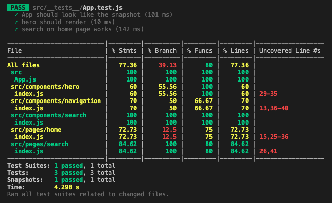

# Adopt-a-pet with react router 6 and jest/React testing library

This is the final project from [codeacademy's React Router course](https://www.codecademy.com/learn/learn-react-router). The course is written for React Router v5, and includes a few warnings that it won't work if you install React Router 6. Having refactored the previous tutorial into React Router 6, I carried out this project with React Router 6.

I've listed out the main differences between what I did and the actual tutorial. Please:

* flag any mistakes/anything unclear.  
* let me know if you'd like to see, or would like to help me, flesh this out into a full tutorial.

There are some tests using jest and React testing library, which are beyond the scope of the tutorial and I've added as a learning exercse.

# Main differences

## Step 1
Run `npm install react-router-dom`.  

This installs the most recent version of React Router, whereas the provided command 
`npm install --save react-router-dom@5.2.0` installs specifically v5.2.0. Note the `--save` flag was deprecated in npm v5 (current version at time of writing is v8.18), and isn't necessary.

## Step 4
Import `Route` and `Routes` from `react-router-dom`.

## Step 5
Updated Route syntax:  `<Route path=":type/*" element={<HomePage />} />`  

* `:type`sets ‘type’ as a param so it can be grabbed by useParams.  
* `*` enables rendering of child links

## Step 6
**to look into**  
This may have been simplified by React Router 6's relative link syntax. Converseley, I found I had to add the home link twice (once with `'/'` only, and once as step 5, as trailing `?` to make parameter optional not available in React Router 6.  
At this point, *App.js* looks like this:

```javascript
import HomePage from './pages/home';
import SearchPage from './pages/search';
import PetDetailsPage from './pages/detail';
import PetDetailsNotFound from './pages/petDetailsNotFound';
import Navigation from './components/navigation';
import { BrowserRouter as Router, Routes, Route } from 'react-router-dom';
	
function App() {
  return (
    <Router>
      <div>
          <Navigation />
        <Routes>
            <Route path="/" element={<HomePage />} />
            <Route path=":type/*" element={<HomePage />} />
        </Routes>
      </div>
    </Router>
  );
}
	
export default App;
```

## Step 9
Note to self: [from the docs](https://reactrouter.com/docs/en/v6/components/nav-link). A ``<NavLink>`` is a special kind of ``<Link>`` that knows whether or not it is "active".

## Step 10
I replaced the style class with ternary operator from the example [in the docs](https://reactrouter.com/docs/en/v6/components/nav-link).

## Step 14
I ignored this step as didn't have the problem it mentioned.

## Step 16
`useHistory()` is deprecated - [docs on switching to `useNavigate()`](https://reactrouter.com/docs/en/v6/upgrading/v5#use-usenavigate-instead-of-usehistory).  

```javascript
import React, { useRef } from 'react';
// import useNavigate here.
import { useNavigate } from 'react-router-dom';
	
const Search = () => {
	
  // get the navigate object here
  const navigate = useNavigate();
  const searchInputRef = useRef();
	
  const onSearchHandler = (e) => {
    e.preventDefault();
	
    const searchQuery = new URLSearchParams({
      name: searchInputRef.current.value
    }).toString();
	
    // imperatively redirect with navigate
    navigate(`/search?${searchQuery}`);
	
  };
	
  return (
    <form onSubmit={onSearchHandler} className="search-form">
      <input type="text" className="search" ref={searchInputRef} />
      <button type="submit" className="search-button">
        🔎
      </button>
    </form>
  );
};
	
export default Search;
```
	
## Step 26
Again, `useHistory()` deprecated, so import and use `useNavigate()` as [per the docs](https://reactrouter.com/docs/en/v6/upgrading/v5#use-usenavigate-instead-of-usehistory).

# Adding tests

I have written these tests with [jest](https://jestjs.io/) and [React testing library](https://testing-library.com/docs/react-testing-library/intro/). 

 
## Jest
Jest is intended to be used for unit tests of your logic and your components rather than the DOM quirks.
*From LogRocket post [comparing react testing libraries](https://blog.logrocket.com/comparing-react-testing-libraries/):*  
[Jest](https://jestjs.io/) is a testing framework created and maintained by Facebook. If you build your React application with Create React App, you can start using Jest with zero config. Just add `react-test-renderer` and the `@testing-library/react library` to conduct snapshot and DOM testing.

With Jest, you can:

- Conduct snapshot, parallelization, and async method tests
- Mock your functions, including third-party node_module libraries
- Execute myriad assertion methods
- View code coverage report

### Conventions
[Jest's default settings](https://github.com/facebook/jest/blob/main/packages/jest-config/src/Defaults.ts) are:

```javascript
testMatch: ['**/__tests__/**/*.[jt]s?(x)', '**/?(*.)+(spec|test).[tj]s?(x)'],
```	
This means jest will look for:

- Files with `.js` suffix in `__tests__` folders.
- Files with `.test.js` suffix.
- Files with `.spec.js` suffix.
The `.test.js` / `.spec.js` files (or the `__tests__` folders) can be located at any depth under the `src` top level folder.

Jest recommends putting the test files (or `__tests__` folders) next to the code they are testing so that relative imports appear shorter. For example, if `App.test.js` and `App.js` are in the same folder, the test only needs to import App from './App' instead of a long relative path. Collocation also helps find tests more quickly in larger projects.


### Configuring jest to display coverage
From [valentiong.com](https://www.valentinog.com/blog/jest-coverage/#:~:text=Jest%20is%20collecting%20coverage%20only,a%20fraction%20of%20our%20code.&text=Now%20Jest%20is%20identify%20correctly%20what%20needs%20to%20be%20tested):  
Code coverage makes possible to spot untested paths in our code. It is an important metric for determining the health of a project. This condif (from the linked tutorial) configures jest to display coverage when `npm test` is run, and for tests to fail if coverage is 90%.

Either add to `package.json` 
```json
	{
  "name": "cute-pets-website",
  "version": "0.1.0",
  "private": true,
  "jest": {
    "collectCoverageFrom": ["./src/**"],
    "coverageThreshold": {
      "global": {
        "lines": 90
      }
    }
  },
  etc }
  ```

...or create `jest.config.js`:
```javascript
// jest.config.js
const {defaults} = require('jest-config');

module.exports = {
	"jest": {
  	"collectCoverage": true,
  	"collectCoverageFrom": ["./src/**"],
  	"coverageThreshold": {
   		"global": {
      	"lines": 90
    	}
  	}
	}
}
```

NB:   `create-react-app` doesn't allow `collectCoverage` flag to be amended, so need to delete that line and run `npm test -- --coverage` each time.

I also created `jest.json.js` to be sure jest knew where everthing was:

```json	
{
	"rootDir": "../",
	"setupFiles": [
    	"<rootDir>/config/setupTests.js",
   		"<rootDir>/config/jest.config.js"
	]
}
```
	
The final jest dir structure now looks like:

	.
	├── config
	│   ├── jest.config.js
	│   ├── jest.json
	│   └── setupTests.js
	└── src
	    ├── __snapshots__
	    ├── __tests__
	    ├── api
	    ├── assets
	    ├── components
	    ├── mocks
	    ├── pages
	    └── practice

Generated using [tree](https://www.computerhope.com/unix/tree.htm): `tree -L 2 -d -I 'coverage|node_modules|public'`


## React Testing Library
[React testing library](https://testing-library.com/docs/react-testing-library/intro/) (RTL) is written to enable testing of your application as if you were the user interacting with the application’s interface, searching directly by the text displayed on screen and without the overhead work of finding the element that contains that text.

It does not require any setup and comes preinstalled with `create-react-app`.

## Tests
I have written 3 tests. These are not exhaustive as the purpose here was for me to get some practice writing tests. First of all, I have pasted in `App.test.js`, and next up I'll go through the tests line by line:

```javascript
// App.test.js
gitimport React from 'react';
import { render, cleanup, screen } from '@testing-library/react';
import userEvent from '@testing-library/user-event';
import '@testing-library/jest-dom/extend-expect';
// import modules to test
import App from '../App';
import Hero from '../components/hero/index';
	
afterEach(cleanup);
	
test('App should look like the snapshot', () => {
  const { asFragment } = render(<App />);
  expect(asFragment(<App />)).toMatchSnapshot();
});
	
test('hero should render', () => {
  const { getByText } = render(<Hero />);
  expect(getByText('Find your perfect pet'));
});
	
test('search on home page works', () => {
  render(<App />);
  // assign search bar button
  const button = screen.getByRole('button', { name: '🔎' });
  // assign search box
  const searchBox = screen.getByRole('textbox', { name: 'search-box' });
  // type in search box
  userEvent.type(searchBox, 'dogs');
  // click button to submit search
  userEvent.click(button);
  // verify search box is there
  expect(screen.getByLabelText('search-box')).toBeInTheDocument();
  // verify search worked submission worked and new page has loaded
  screen.getByText('Results for dogs');
});
```

And the output:  




### afterEach(cleanup)
`afterEach` runs the command after each individual test.
`cleanup` is an [RTL command](https://testing-library.com/docs/react-testing-library/api/#cleanup) to unmount React trees mounted with render. Calling this prevents memory leaks and test isolation.

### test 1
This test takes a [snapshot](https://jestjs.io/docs/snapshot-testing) and compares the rendered DOM. It passes if the snapshot taken in the test matches the snapshot stored in file: in other words it confirms the UI has not changed.
There are two scenarios when there is a change:
1. unexpected change: something has probably broken, and telling us this is the purpose of the test.
2. expected change (eg updated a UI component). jest will prompt you to update the snapshot.

#### Line by line
Test setup:  
`test('App should look like the snapshot', () => {`
  
Render App and assign to asFragment:  
`const { asFragment } = render(<App />);`  

compare rendered app to stored snapshot:
`expect(asFragment(<App />)).toMatchSnapshot();
});`

### test 2
This test uses [getByText](https://testing-library.com/docs/queries/bytext) to search the DOM for the provided text. It passes if the text is found once, and throws an error either if the text is not found, or is found more than once.

#### Line by line
Test setup:  
`test('hero should render', () => {`
 
Unpacks getByText command and assigns to rendered object. 
`const { getByText } = render(<Hero />);`  

Pass expected text into getByText.
`expect(getByText('Find your perfect pet'));
});`


### test 3
This test simulates a search by isolating the search box, entering some text, clicking the search button, and checking the DOM has changed to the search results page.

#### Line by line
Test setup:  
`test('search on home page works', () => {`

Render the app:  
`render(<App />);`

Isolate search bar by role and assign to _button_:
`const button = screen.getByRole('button', { name: '🔎' });`

Assign search box
`const searchBox = screen.getByRole('textbox', { name: 'search-box' });`

Enter search term _dogs_ into search box
`userEvent.type(searchBox, 'dogs');`

Click _button to submit search:  
`userEvent.click(button);`

Verify search box is there
`expect(screen.getByLabelText('search-box')).toBeInTheDocument();`

Verify search worked submission worked and the results page has loaded
`screen.getByText('Results for dogs');
});`
